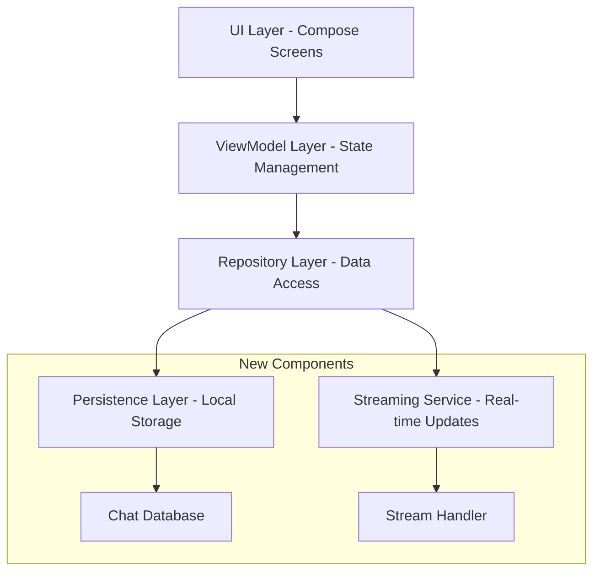

# Design Document: UI/UX Improvements

## Overview

This design outlines the enhancements to the jury app's user interface, user experience, and core functionality. The improvements focus on streamlining navigation from three tabs to two, implementing persistent chat storage, adding streaming responses, and creating a more polished visual design using modern Material Design 3 principles.

## Architecture

The enhanced architecture maintains the existing MVVM pattern with Compose UI while adding new components for persistence and streaming:



## Components and Interfaces

### 1. Navigation System Redesign

**Current State**: Three tabs (Run, Jury, Agents)
**New State**: Two tabs (Jury, Agents)

The ExecutionTab functionality will be integrated into the JuryTab, providing a unified experience for conducting trials and viewing results.

```kotlin
// Simplified Navigation Structure
sealed class AppTab {
    object Jury : AppTab()
    object Agents : AppTab()
}
```

### 2. Enhanced UI Components

**Material Design 3 Implementation**:
- Consistent color schemes using Material You theming
- Improved typography hierarchy
- Enhanced spacing and layout principles
- Smooth animations and transitions
- Responsive design for different screen sizes

**Key UI Improvements**:
- Redesigned chat interface with better message bubbles
- Improved loading states and progress indicators
- Enhanced visual feedback for user interactions
- Better accessibility support

### 3. Persistence Layer

**Chat Storage Interface**:
```kotlin
interface ChatPersistenceService {
    suspend fun saveMessage(message: ChatMessage): Result<Unit>
    suspend fun loadChatHistory(trialId: String): Result<List<ChatMessage>>
    suspend fun saveTrial(trial: Trial): Result<Unit>
    suspend fun loadTrials(): Result<List<Trial>>
    suspend fun clearChatHistory(trialId: String): Result<Unit>
}
```

**Implementation Strategy**:
- Use SQLite database for local storage
- Implement data serialization/deserialization for complex objects
- Provide migration support for future schema changes
- Handle concurrent access safely

### 4. Streaming Service

**Streaming Interface**:
```kotlin
interface StreamingService {
    fun streamResponse(
        prompt: String,
        persona: AgentPersona
    ): Flow<StreamingResponse>
    
    suspend fun cancelStream(streamId: String)
}

data class StreamingResponse(
    val streamId: String,
    val content: String,
    val isComplete: Boolean,
    val error: String? = null
)
```

**Implementation Details**:
- Use Kotlin Flows for reactive streaming
- Implement proper error handling and recovery
- Support stream cancellation
- Handle connection interruptions gracefully

## Data Models

### Enhanced Chat Models

```kotlin
@Serializable
data class ChatMessage(
    val id: String,
    val trialId: String,
    val sender: String,
    val content: String,
    val timestamp: Long,
    val messageType: MessageType,
    val streamingState: StreamingState = StreamingState.COMPLETE
)

@Serializable
enum class MessageType {
    USER_INPUT,
    AGENT_RESPONSE,
    SYSTEM_MESSAGE,
    MODERATOR_MESSAGE
}

@Serializable
enum class StreamingState {
    STREAMING,
    COMPLETE,
    ERROR
}
```

### Persistence Models

```kotlin
@Serializable
data class PersistedTrial(
    val trial: Trial,
    val messages: List<ChatMessage>,
    val lastAccessed: Long,
    val version: Int = 1
)
```

## Correctness Properties

*A property is a characteristic or behavior that should hold true across all valid executions of a system-essentially, a formal statement about what the system should do. Properties serve as the bridge between human-readable specifications and machine-verifiable correctness guarantees.*

Based on the prework analysis, here are the testable correctness properties:

### Property 1: Tab State Preservation
*For any* tab state and any sequence of tab switches, returning to a previously visited tab should restore its exact state
**Validates: Requirements 1.2**

### Property 2: UI Consistency
*For any* UI component across different screens, it should use consistent color schemes and typography tokens from the design system
**Validates: Requirements 2.1**

### Property 3: Layout Spacing Consistency
*For any* UI layout, spacing values should follow the design system guidelines and maintain consistent proportions
**Validates: Requirements 2.2**

### Property 4: Visual Hierarchy
*For any* content display, text elements should use appropriate typography styles that create clear visual hierarchy
**Validates: Requirements 2.3**

### Property 5: Responsive Layout
*For any* screen size within supported ranges, the layout should adapt appropriately without content overflow or accessibility issues
**Validates: Requirements 2.5**

### Property 6: Immediate Message Persistence
*For any* chat message sent or received, it should be stored in the persistence layer immediately and be retrievable
**Validates: Requirements 3.1**

### Property 7: Chat History Restoration
*For any* stored chat history, after app restart, all messages should be restored in the correct order with accurate timestamps
**Validates: Requirements 3.2**

### Property 8: Message Order Preservation
*For any* sequence of messages stored, they should be retrieved in the same chronological order with preserved timestamps
**Validates: Requirements 3.3**

### Property 9: Serialization Round Trip
*For any* chat data object, serializing then deserializing should produce an equivalent object
**Validates: Requirements 3.4**

### Property 10: Incremental Streaming Display
*For any* streaming response, partial content should be displayed progressively as it arrives, before the complete response
**Validates: Requirements 4.1**

### Property 11: Streaming Error Recovery
*For any* streaming connection interruption, the service should handle it gracefully without crashing or losing data
**Validates: Requirements 4.2**

### Property 12: Streaming Integrity
*For any* interrupted stream, partial message content should be preserved and marked appropriately
**Validates: Requirements 4.4**

### Property 13: Stream Completion Handling
*For any* completed stream, the message should be marked as complete and persisted to storage
**Validates: Requirements 4.5**

### Property 14: Cross-Tab Agent Synchronization
*For any* agent modification in the Agents tab, the changes should be immediately reflected in the Jury tab
**Validates: Requirements 5.1**

### Property 15: Agent Reference Consistency
*For any* agent modification, all references to that agent throughout the application should be updated consistently
**Validates: Requirements 5.3**

### Property 16: Agent Configuration Validation
*For any* invalid agent configuration, the system should reject it and provide appropriate error feedback
**Validates: Requirements 5.4**

### Property 17: Agent State Synchronization
*For any* agent state change, it should be reflected consistently across all tabs and components
**Validates: Requirements 5.5**

### Property 18: UI Response Time
*For any* UI operation, the system should respond within 200ms for standard interactions
**Validates: Requirements 6.1**

### Property 19: Large Data Loading Efficiency
*For any* large chat history, loading should complete within reasonable time bounds without blocking the UI
**Validates: Requirements 6.2**

### Property 20: Concurrent Streaming Performance
*For any* set of concurrent streams, performance should not degrade below acceptable thresholds
**Validates: Requirements 6.3**

### Property 21: Error Message Quality
*For any* error condition, the system should provide meaningful error messages with recovery options
**Validates: Requirements 6.4**

<function_calls>
<invoke name="prework">
<parameter name="featureName">ui-ux-improvements

## Error Handling

### 1. Persistence Layer Error Handling
- **Database Connection Failures**: Implement retry logic with exponential backoff
- **Storage Space Issues**: Provide user feedback and cleanup options for old data
- **Data Corruption**: Implement data validation and recovery mechanisms
- **Migration Failures**: Provide rollback capabilities and error reporting

### 2. Streaming Service Error Handling
- **Network Interruptions**: Implement automatic reconnection with exponential backoff
- **Timeout Handling**: Set appropriate timeouts and provide user feedback
- **Partial Response Handling**: Preserve partial content and allow manual retry
- **Rate Limiting**: Implement proper backoff strategies for API rate limits

### 3. UI Error Handling
- **Loading State Management**: Show appropriate loading indicators and timeout handling
- **User Input Validation**: Provide real-time validation feedback
- **Navigation Errors**: Handle invalid navigation states gracefully
- **Component Error Boundaries**: Implement error boundaries to prevent app crashes

### 4. Agent Management Error Handling
- **Configuration Validation**: Validate agent configurations before saving
- **State Synchronization Failures**: Implement conflict resolution strategies
- **Agent Communication Errors**: Provide fallback mechanisms and user feedback

## Testing Strategy

### Dual Testing Approach

The testing strategy employs both unit testing and property-based testing to ensure comprehensive coverage:

**Unit Tests**:
- Test specific examples and edge cases
- Validate integration points between components
- Test error conditions and recovery mechanisms
- Focus on concrete scenarios and boundary conditions

**Property-Based Tests**:
- Verify universal properties across all inputs
- Test with randomized data to catch edge cases
- Validate system invariants and correctness properties
- Ensure comprehensive input coverage through randomization

### Property-Based Testing Configuration

- **Testing Framework**: Use Kotest Property Testing for Kotlin
- **Minimum Iterations**: 100 iterations per property test
- **Test Tagging**: Each property test must reference its design document property
- **Tag Format**: `**Feature: ui-ux-improvements, Property {number}: {property_text}**`

### Testing Categories

**1. UI Component Testing**:
- Unit tests for individual Compose components
- Property tests for UI consistency and responsive behavior
- Integration tests for navigation and state management

**2. Persistence Layer Testing**:
- Unit tests for database operations and edge cases
- Property tests for serialization round-trips and data integrity
- Integration tests for app restart scenarios

**3. Streaming Service Testing**:
- Unit tests for connection handling and error scenarios
- Property tests for streaming behavior and data integrity
- Integration tests for UI updates during streaming

**4. Performance Testing**:
- Unit tests for specific performance scenarios
- Property tests for performance under various load conditions
- Integration tests for end-to-end performance validation

### Test Data Management

- Use factories for generating test data
- Implement proper test isolation and cleanup
- Use in-memory databases for persistence testing
- Mock external dependencies appropriately

### Continuous Integration

- Run all tests on every commit
- Include performance regression testing
- Validate UI consistency across different screen sizes
- Test on multiple platform targets (Android, Desktop)